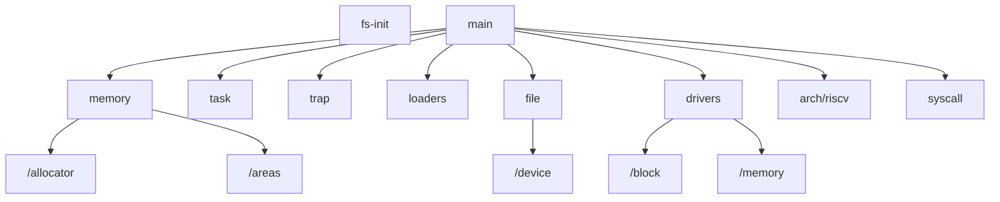

# 操作系统设计赛 - 初赛文档

## 开发人员

清华大学 `Maturin`队：闭浩扬、张熙至、尤予阳。

同时也感谢在开发过程中帮助我们指导老师、学长、评测平台工程师以及比赛提供的技术报告与交流。

## 项目简介

`Maturin`是一个基于`FU740`开发板的、用 `rust` 实现的、多核OS。

项目有完整的代码及注释文档（中文），可以通过在 `/kernel` 文件夹下 `make doc` 生成与`rust`规范相关的完整文档，也可以直接阅读代码中的行级注释。

下面依次对项目中的模块和文件进行说明，在说明的过程中也会介绍对应的框架、思路、重点和问题：

## 架构和模块说明

`kernel` 文件夹下为主要开发的OS。除此之外，与`kernel`同级的还有一个`fs-init`，这个模块用于生成测试需要的FAT镜像，实际os编译和运行时不使用。



对这些模块简要介绍如下：

#### ../fs-init

生成FAT镜像，并在其中加入测例程序。注意这个模块不会在OS编译和运行时使用，只用于在启动前生成镜像。

在本机，OS的启动流程为

```bash
cd kernel
make testcases-img
make run
```

其中`make testcases-img`会用到这一句生成镜像。

而在比赛评测时不需要这个模块，因为文件系统镜像是预载的。

#### /trap

内核与用户态中断处理。实现了可以在内核态开中断。

这个模块原本参考的是`rCore`，但内核态开中断的机制导致`MaturinOS`需要使用完全不同的机制处理中断

当OS由于异常中断trap时，会有三种可能（`rCore`只有第一种）

- trap来自用户程序用户态
- trap来自用户程序的内核态
- trap来自没有在执行用户程序的核的内核态

这分别对应了进入trap时`sp`和`sscratch`的不同状态：

| 来源      | sp指向 | sscratch存储 | trap行为          |
| ------- | ---- | ---------- | --------------- |
| 用户程序用户态 | 用户栈  | 内核栈        | csrrw后转内核栈处理    |
| 用户程序内核态 | 内核栈  | 用户栈        | 不csrrw，直接压栈处理   |
| 空闲核内核态  | 内核栈  | 0          | csrrw两次，之后压栈处理* |

注意最后一种情况下，csrrw两次和不适用csrrw的效果是一样的。这样处理是因为**进入trap时，内核只能看到sp**，无法分辨后两种情况，因此需要换出sscratch里存的值再做判断。

> 内核如何分别用户栈和内核栈？
> 
> 因为MaturinOS的内核(虚)地址一定在高地址，即 0xffff_ffff_xxxx_xxxx，而用户地址一定在低地址，即 0x0000_0000_xxxx_xxxx，所以通过将 sp 当作有符号数然后使用`bgez`和`beqz`分辨即可。

类似地，从trap返回时也需要对应作上述处理，但是这时候是通过`sstatus`的`SPP`位来判断来源是否是用户态再复原。

> 既然有SPP可以判断，为什么进入trap时不通过这个信息来判断？
> 
> 因为异常中断不同于普通的函数调用规范，每一个寄存器里都有用户信息，没有一个安全的寄存器可以用来判断。rCore中使用了sscratch，但这只是对应第一种情况，在分辨异常中断属于上述三种情况的哪一种时，sscratch里也有信息，也不能随意写掉。当然，可以在sscratch里放一段安全的地址，然后不管什么情况都把所有东西先存到那里再处理。但我们觉得既然可以用分支判断解决问题，就没有必要再新增结构了。

#### /memory

页表虚拟地址空间管理，负责页表和内存段的映射。

在内核态，地址空间的映射关系一直都是 虚拟地址=物理地址+`0xffff_ffff_0000_0000`，**但在初始化的过程中可访问的地址和这些地址上的权限会不同**。下面依次介绍内核态地址空间映射的变化过程：

##### 1. 最开始用汇编构造的原始页表

内核刚启动时，在 `entry.S` 构造了如下页表

```assembly
    .section .data
    .align 12
boot_page_table_sv39:
    .quad 0
    .quad 0
    # 0x00000000_80000000 -> 0x80000000 (1G, VRWXAD)
    .quad (0x80000 << 10) | 0xcf
    .zero 8 * 507
    # 0xffffffff_80000000 -> 0x80000000 (1G, VRWXAD)
    .quad (0x80000 << 10) | 0xcf
    .quad 0
```

此时可用的物理地址是 `[0x8000_0000, 0xbfff_ffff]`，可以通过物理地址(实际上是恒等映射的虚拟地址)和虚拟地址访问，可以任意读/写/执行。

> 这里的页表看起来只有一页，而不是Sv39规定的三级页表。这是用了 RISC-V 的“大页”机制：当第一级或者第二级的某个页表项在 R/W/X 位有值时，就把它视为一个 1GB 或 2MB 的页，直接把表项内容当作物理页号；而只有 VALID=1但R=W=X=0时才会认为表项的内容是下一级页表的地址。

##### 2. 初始化过程中每个核的页表

在初始化函数 `start_kernel()` 中，每个核调用了`memory::kernel_page_table_init();` 此时内核中的地址按照`linker.ld` 中的分段设置权限，如 `rodata`段的内容是只读等等。

其中特别加了以下映射：

- 内核栈：每个核的内核栈的最后一页不写进 MemorySet 和页表里，这意味着内核栈用到最后一页时会触发内核的缺页异常。这是为了不让一个核的内核栈溢出到其他核的栈里。
- `"phys_memory"` ：OS认为物理内存的空间是从 `0x80200000` 到 `PHYS_MEMORY_END`(=`0x8800_0000`，是 `constants.rs` 里的常数)，这段地址在内核态都可以直接访问。所以初始化会把除了 linker 中指定的内核代码段外的所有空间，也就是 [`kernel_end`, `PHYS_MEMORY_END`] 写进页表并赋读和写的权限。

##### 3. 每个用户程序的页表

在用户程序通过`fork` 或`exec`初始化时，会给每个用户程序初始化 MemorySet 和对应页表。其中内核态的部分和上面所述相同，用户态的部分是由 `/loaders` 子模块中的 `ElfLoader`读取用户程序信息后映射的。

用户程序申请的新的内存空间实际上是在`phys_memory`段里的。因为用户态访问时的虚拟地址和内核态直接访问`phys_memory`段的虚拟地址不同（后者一定有前缀 `0xffff_ffff`），所以这它们都放在 MemorySet 里并不冲突。

##### /memory/allocator

堆、页帧、进程号(PID)的分配，需要在启动时由且仅由一个核进行初始化。

如果内核里需要申请新的空间来放新的东西，那么有以下三种可能的情况：

1. 在局部变量通过某个结构体的 fn new () -> Self {...} 构造。这种情况下结构本身在内核栈上

2. 通过 Vec 等构造一个变长的数据结构。这种情况下结构在堆上

3. 直接向页帧分配器要一个帧，然后自己存起来。**在这种情况下，可以说这个结构"拥有"它申请的页，但页表和 `MemorySet` 里不会添加这一项。**事实上，申请到的页是在 physical_memory 段里的，详见页帧分配器(`frame.rs`)。理论上来说，内核里的代码可以任意读写 physical_memory 段中的地址，但只要"约定"每个结构在需要内存时都先申请空间再使用，就至少可以保证不会错误读写到别的数据

> 为什么要有第三种申请空间方式而不是把这样的申请都放在堆上？
> 
> 因为堆内部的空间不大，目前设定为 4MB。堆分配器(`heap.rs`)占用的空间在 `bss` 里，而一般来说我们不太希望内核编译出来的文件里本身就带一堆大“数组”，所以不会把堆开得特别大。

##### /memory/areas

表示一段有相同访问权限的内存区间，也负责处理区间内的缺页异常。页帧可以在new时就分配，也可以lazy分配。在lazy分配的情况下，只有发生缺页异常且OS判断权限正确时才会实际分配物理页。

在`fork`时，lazy分配的内存段只会复制已有实际物理页的那些虚拟页。注意这并**没有**实现`copy on write`，但仍然能减少一些开销。

#### /arch/riscv

程序入口以及对其他一些内嵌汇编的封装，主要是 sbi 调用和跟串口的交互。

整个OS运行的地址实际上不是完全一致的：

- 注意`/boot/linker.ld`中起始地址是高地址，也就是说OS实际是在高地址编译的。
- 程序实际启动时，`OpenSBI`会把`os.bin`放到低地址开始执行
- 但是在刚进入内核时，`/boot/entry.S`中会启动Sv39页表，之后OS会运行在虚拟地址(高地址)上。

之所以要写这个转换，是因为`OpenSBI`要求把OS放在`0x8020_0000`，这是一个低地址，但是OS的编译和运行时地址必须统一，否则在`match`语句时，`rustc`编译器可能会因为编译优化作出错误的地址转换（是编译器本身的问题，详见报告`0507.pptx`）

#### /task

任务管理及调度。

这里是所有核共用一个调度器，但每个核(见`cpu_local.rs`)会把正在或即将执行的用户程序保存在一个`Option<Arc<TaskControlBlock>>`里。或者说，可以认为每个核有一个长为1的任务队列，同时全局有一个调度器管理那些没有被任何核所持有的用户程序。

任务控制块中只有`TaskContext`没有 `TrapContext` ：

- 用户态和内核态共用页表，所以用户`ecall`时可以跳转到内核在初始化时设的 trap 地址，这样就不需要为每个用户程序配置 trap 对应的虚拟地址映射了

同理，也不需要单独配置 `KernelStack` 在用户地址空间中的映射。这点和本项目参考的 `rCore-tutorial` 有明显的不同

> `rCore-tutorial` 的内核态与用户态使用的页表不同，所以它的 trap 进入内核(见 [任务切换 - rCore-Tutorial-Book-v3 3.6.0-alpha.1 文档](https://rcore-os.github.io/rCore-Tutorial-Book-v3/chapter3/2task-switching.html)) 过程大致是
> 
> 1. 把sp换到”内核栈在用户地址空间中的地址"
> 2. 保存需要的寄存器
> 3. 读取 rust 函数 trap_handler 的地址，切换到内核栈
> 4. 切换到内核的页表，刷新TLB
> 5. 跳转到 trap_handler

需要说明的是，`rCore` 使用内核态与用户态的设计是比我们设计的这个OS更安全的，但这个特性也使得 **切换用户态/内核态的地点与切换用户页表/内核页表的地点不一致，所以 trap.S 中进入内核时，需要在用户地址空间+内核态下工作。**为了实现这个事情， `rCore` 需要在地址空间映射中做特殊约定(见 [https://rcore-os.github.io/rCore-Tutorial-Book-v3/chapter4/5kernel-app-spaces.html)，同时在页表/任务管理/trap的代码实现中插入很多关于这个约定的特殊代码。](https://rcore-os.github.io/rCore-Tutorial-Book-v3/chapter4/5kernel-app-spaces.html)%EF%BC%8C%E5%90%8C%E6%97%B6%E5%9C%A8%E9%A1%B5%E8%A1%A8/%E4%BB%BB%E5%8A%A1%E7%AE%A1%E7%90%86/trap%E7%9A%84%E4%BB%A3%E7%A0%81%E5%AE%9E%E7%8E%B0%E4%B8%AD%E6%8F%92%E5%85%A5%E5%BE%88%E5%A4%9A%E5%85%B3%E4%BA%8E%E8%BF%99%E4%B8%AA%E7%BA%A6%E5%AE%9A%E7%9A%84%E7%89%B9%E6%AE%8A%E4%BB%A3%E7%A0%81%E3%80%82)

而本项目中 trap 进入内核的实现不用切换页表，所以也简化了配置用户页表特殊页面、trap 反复折腾等等事情。

#### /syscall

系统调用处理。

这里除了把所有系统调用按类型分支到文件处理`fs.rs`、进程内存处理 `process.rs`和时间处理 `times.rs`三个子模块之外，还有一个`flags.rs`，用于保存所有`syscall`中用到的状态位、标志位、结构体定义等。

#### /drivers

设备和驱动。

`block`下是块设备的驱动，使用MMIO；`memory`下是内存fs(即认为内存中的一段地址就是文件系统的内容)驱动。

#### /file

一些满足文件要求的类(标准输入输出/管道/文件系统中的文件等)，以及每个进程管理文件描述符的 `FdManager` 类。

其中`device`子模块提供了和文件系统相关的功能，如分隔简化路径、支持读超过一个cluster的数据、获取文件属性、链接、挂载等。

#### /loaders

从 `.elf` 文件中读取用户程序信息并生成对应的VMA，返回入口地址和用户栈地址。

## 项目依赖

- 部分依赖库是评测机上有的库，会直接通过`Cargo.toml`引入
- 另一部分项目依赖放在`/dependencies`目录下，这些是**直接依赖**的库。
- 最后一部分在根目录下，是使用了代码，但经过大幅度修改、**只适用于这个OS**的库。

后两种库的存在是为了规避评测机本地没有又连不上网的问题。

### 依赖库介绍

#### /dependencies/bitmap-allocator

一个分配器，用于页帧和pid分配。来自 `https://github.com/rcore-os/bitmap-allocator`

#### /dependencies/kernel-sync

依赖库，提供在使用时关中断的 Mutex ，来自方便在内核常开中断

#### /dependencies/core2

提供 no_std 下原来 std::io 类型的相关 Trait 实现，来自 `"https://github.com/bbqsrc/core2"`。

`rust-fatfs` 需要针对 `fscommon::BufStream` 进行读写，它相当于一种缓存，本体在内存中，但会在需要的时候读写"文件"，且在 Drop 时也会自动写回"文件"。上文的文件在 `std` 环境下可以是 `std::fs::File`，但在 `no_std` 环境下，如这个OS，可以是一个块设备。
为了对不同的"文件"都能实现缓存，`fscommon::BufStream` 中对这个"文件"的要求就是实现 `std::io::{Read, Write, Seek}`。当然，`no_std` 环境下需要找一个类似的接口，如原项目的 `core_io` 和现在的 `core2`。

#### /dependencies/easy-fs

之前使用的文件系统，来自 `rCore`，是`https://github.com/rcore-os/rCore-Tutorial-v3` 的一部分。

目前已弃用。

#### /dependencies/easy-fs-fuse

配合 `easy-fs` 导入用户程序。来自 `rCore`，是`https://github.com/rcore-os/rCore-Tutorial-v3` 的一部分。

目前已弃用。

#### /rust-fatfs

是一个`FAT32`格式的文件系统示例，来自 `https://github.com/rafalh/rust-fatfs`

这个文件系统本来是面向单核的，现改成了多核实现。具体来说需要 RefCell/Cell 改成 lock::Mutex、各个结构体内对文件系统本身的带生命周期的引用 `&'a FileSystem` 改为 Arc 等等，然后手动检查冲突和死锁。

#### /fscommon

文件系统在内存中的 `buffer` 层抽象。

本来应该是 `rust-fatfs` 的依赖库，来自 `https://github.com/rafalh/rust-fscommon`，但它所依赖的 [core_io](%60https://github.com/jethrogb/rust-core_io%60) 库限定死了 `rustc` 版本，而且已经没有再更新了，导致新版的编译库无法在 `no_std` 下 build 这个库。在 [这个issue](https://github.com/jethrogb/rust-core_io/issues/35) 里能看到同样有其他人遇到了从 `rust-fatfs` 到这个 `core_io` 的依赖库问题。
解决方案是换掉 [core_io](%60https://github.com/jethrogb/rust-core_io%60)，改为 [core2](%60https://github.com/technocreatives/core2%60)。

更换依赖库后，因为这两个库还是有一些接口上的不同，所以 `Cargo.tom;/dependencies` 和代码也需要修改。改后的项目已经和原项目不同了，因此你可以看到在 `kernel` `rust-fatfs` 的依赖中，`fscommon` 都使用相对路径。但是在 `fs-init` 中直接使用的是原版的 `fscommon`，因为它需要在 `std` 环境下运行，而修改后只支持 `no_std` 了。

`fscommon` 原项目采用 `MIT License`，修改后的项目也不变，所以可以在 `Cargo.toml` 中找到原作者和项目的信息。不过因为忘记在改这个模块的代码前 commit 一次，所以可能不太方便比较修改了哪些内容。

#### /user

是`rCore`用于测试的用户程序。来自 `https://github.com/rcore-os/rCore`，部分测例和用户库有改动。

注意，这个rust用户库处理用户程序的方式和比赛测例库有所不同（如`argc/argv`在从内核返回时已放在`a0/a1`中而非放在内核栈顶），而目前的OS已经作了适配比赛测例库的修改，不保证还能正常运行这里的程序。

### 其他说明

在编写代码的过程中，我们学习了一些其他OS的实现，它们不以依赖库的形式存在，但这些参考对我们也有很大帮助。这些OS包括：

- `rCore-Tutorial`，来自 `https://github.com/rcore-os/rCore-Tutorial-v3`
- `zCore`，来自`https://github.com/rcore-os/zCore`
- `aCore`，来自`https://github.com/rcore-os/aCore/`
- `BlogOS`，来自`https://github.com/phil-opp/blog_os`

## 其他重要文件及目录

#### /oscomp_testcases

为了方便在本地进行测例测试，我们参照比赛网站的指引下载了测例，编译后放在这里。

#### /repo

开发过程中的汇报与交流文件

#### /doc

项目文档

#### rust-toolchain

指定了本项目的编译环境是 `nightly-2022-04-11`

#### LICENSE

使用 MIT 协议。

项目本身公开，我们欢迎其他人学习、借鉴这个项目，也欢迎大家来给我们提意见和建议。
